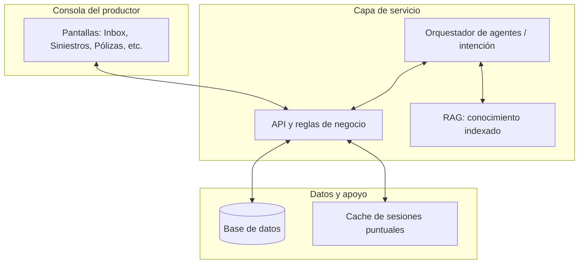

# Copilot Seguros — Manual de producto y composición de la solución

Este documento está pensado para **dueños de producto**, **PAS** y **equipos comerciales** que quieren entender *qué es* la consola del productor, *para qué sirve cada parte* y *cómo encajan los módulos* en una visión ampliable. El detalle de instalación y comandos sigue en el `README.md` de la raíz del repositorio.

---

## 1. Qué es la solución

**Copilot Seguros (consola del productor)** es un entorno de trabajo digital para un **PAS** (productor asesor de seguros / agencia) que concentra en un solo lugar:

- la **operación del día a día** (conversaciones, tareas, aprobaciones);
- la **cartera** (clientes, pólizas, aseguradoras);
- el **ciclo de siniestros** (ingreso, seguimiento, cierre o revisión);
- y el **asistente** (orquestador de intención + conocimiento indexado, RAG), para borradores y respuestas apoyadas en documentación propia del PAS.

No sustituye por sí mismo el core de una compañía aseguradora ni el sistema policy-administrativo completo; **ordena la experiencia del productor** y deja preparadas las piezas para integrar datos y automatización cuando la organización lo requiera.

---

## 2. Idea de multi-tenant (PAS vs aseguradora)

En esta solución se usa el concepto de **tenant** como **una organización usuaria del PAS**: típicamente una agencia o red de productores que opera la consola.

- **Un tenant** = un aislamiento de datos de negocio (clientes, pólizas, chats, etc.).
- **Las aseguradoras** no son “tenants”: son **entidades de catálogo** dentro del mismo PAS (un PAS trabaja con varias compañías).
- Una **póliza** puede estar asociada a una **aseguradora** concreta; un **siniestro** hereda el contexto a través de la póliza (y del cliente).

Así se evita mezclar carteras entre agencias y, a la vez, se modela la realidad de un PAS que comercializa múltiples compañías.

---

## 3. Cómo está compuesta la solución (vista lógica)

A alto nivel, la plataforma se apoya en tres capas que el usuario no ve directamente, pero explican *de dónde salen* las pantallas:

| Capa | Rol |
|------|-----|
| **Interfaz (consola web)** | Donde el productor trabaja: menú, listados, formularios, detalle. |
| **Servicio de aplicación (API)** | Reglas de negocio, validaciones, orquestación de flujos y conexión a datos. |
| **Datos y servicios de apoyo** | Base de datos (cartera, siniestros, tareas, etc.), caché de sesiones cortas cuando hace falta, y en el futuro conectores a aseguradoras o canales. |

En un despliegue tipo producto, el flujo natural sería: el productor inicia sesión, la consola identifica su **organización (tenant)** y solo muestra y modifica lo que le corresponde.

---

## 4. Módulos de la consola: qué hacen y cómo se componen

Cada bloque siguiente describe **el propósito para el usuario**, **qué contiene en términos de producto** y **hacia dónde puede evolucionar**.

### 4.1 Acceso e identidad

- **Propósito:** que cada usuario entre con sus credenciales y opere solo dentro de su organización.
- **Composición:** login, sesión, vínculo usuario ↔ tenant. En evolución: integración con proveedor de identidad corporativo (SSO), roles más finos y auditoría de accesos.
- **Valor para el PAS:** confianza y trazabilidad; base para cumplimiento y escala en equipos grandes.

### 4.2 Inicio (panel principal)

- **Propósito:** una sola vista del “estado del negocio” del momento: volumen de clientes, conversaciones abiertas, siniestros, alertas de renovación, carga de tareas y aprobaciones.
- **Composición:** lecturas agregadas de los demás módulos; no es un sistema aparte, es el **tablero** que resume lo que ya existe en datos operativos.
- **Evolución:** KPIs configurables, filtros por equipo o ramo, exportación para reporting.

### 4.3 Inbox (conversaciones)

- **Propósito:** gestionar el **canal de contacto** con el cliente (estilo bandeja): ver conversaciones, responder, asociar un cliente de cartera, cerrar cuando el caso está resuelto.
- **Composición:** hilos de mensajes; filtros por estado o canal; en paralelo, posibilidad de pedir **borradores** al asistente según el contexto.
- **Evolución:** WhatsApp Business API u otros canales colgando del mismo modelo de conversación; plantillas de respuesta por ramo o por aseguradora.

### 4.4 Clientes (CRM ligero)

- **Propósito:** mantener la **cartera** de personas y datos de contacto como fuente única para el resto del flujo (pólizas, chats, siniestros).
- **Composición:** fichas de cliente; altas, bajas y búsqueda.
- **Evolución:** duplicados, consentimiento, integración con sistemas externos de CRM o facturación.

### 4.5 Aseguradoras (catálogo)

- **Propósito:** registrar **con qué compañías** trabaja el PAS (nombre, código interno, datos de contacto o integración cuando existan).
- **Composición:** maestro de aseguradoras **por tenant**; las pólizas referencian este catálogo para saber “de qué compañía es” cada contrato.
- **Evolución:** APIs por compañía, mapeo de productos y condiciones generales en el tiempo.

### 4.6 Pólizas

- **Propósito:** ver la **cartera contratada**, vigencias y alertas de **renovación** (por fechas de fin de vigencia).
- **Composición:** póliza ligada a cliente y, cuando corresponda, a aseguradora y producto; en demo puede existir una alta rápida para pruebas.
- **Evolución:** endosos, renovaciones automáticas sugeridas, documentación adjunta y sincronización con sistemas de emisión.

### 4.7 Siniestros

- **Propósito:** seguir el **ciclo de vida** de un reclamo: desde un primer ingreso estructurado hasta estados finales, con **historial** de lo ocurrido y marca de **revisión humana** cuando el PAS quiere revisar antes de avanzar.
- **Composición:**  
  - **Listado y detalle:** tipo de hecho, estado, vínculo con póliza y cliente; **aseguradora** inferida por la póliza cuando está cargada.  
  - **Intake (asistente guiado):** recopila datos mínimos en pasos para generar un borrador coherente sin depender de formularios libres al inicio.
- **Evolución:** numeración oficial con la compañía, pagos, peritos, integración con mesas de ayuda de la aseguradora.

### 4.8 Tareas y SLA

- **Propósito:** que nada crítico se pierda: **compromisos con fecha**, asignación a una persona del equipo y cierre explícito.
- **Composición:** tareas abiertas o en curso, vencimiento, tipo y vínculo opcional a otro objeto (conversación, póliza, etc., según evolucione el modelo).
- **Evolución:** reglas de escalamiento, recordatorios automáticos, cuadros de mando por equipo.

### 4.9 Aprobaciones (workflow comercial)

- **Propósito:** una **cola de decisión** para ítems que requieren OK explícito del PAS antes de seguir (por ejemplo cotizaciones o cambios sensibles en negocio).
- **Composición:** listado de solicitudes pendientes y decisión aprobar / rechazar.
- **Evolución:** políticas por monto, por ramo, delegación y firma digital.

### 4.10 Agentes (orquestador)

- **Propósito:** **interpretar la intención** del mensaje (venta, siniestro, consulta de póliza, etc.) y devolver **borradores** y siguientes pasos sugeridos, en un entorno de prueba para el PAS.
- **Composición:** motor de enrutamiento hacia “agentes” especializados y uso opcional de conocimiento indexado.
- **Evolución:** políticas de tono por marca, límites por canal, métricas de calidad y feedback del productor sobre cada respuesta.

### 4.11 Conocimiento (RAG)

- **Propósito:** que las respuestas del asistente se **apoyen en documentación propia**: condiciones, playbooks, FAQs de la agencia, etc., **por tenant** y por tipo de documento (scope).
- **Composición:** indexación de textos en fragmentos recuperables; estadísticas por tipo de conocimiento para administración.
- **Evolución:** sincronización automática desde portales de compañías, control de versión y cumplimiento (qué versión de condiciones generales se citó).

---

## 5. Flujos típicos que la solución ordena

1. **Cliente escribe por WhatsApp (futuro canal)** → aparece en **Inbox** → se asocia a **Cliente** → el **Orquestador** sugiere respuesta con **Conocimiento** si hay índice.
2. **Reporte de siniestro** → **Intake** o carga directa → **Siniestro** con timeline → cambio de estado y revisión si hace falta.
3. **Renovación próxima** → **Pólizas** muestra alertas → el equipo actúa desde **Tareas** o contacto desde **Inbox**.

---

## 6. Escenarios de demo (paso a paso)

Estos guiones están pensados para una demo de 15–25 minutos con un PAS. La idea es **recorrer valor**, no “mostrar pantallas”.

### 6.0 Preparación rápida (1 minuto)

- Tener sesión iniciada con un usuario demo.
- Tener cargadas algunas **aseguradoras**, **pólizas**, **siniestros**, **tareas** y **conversaciones** (dataset demo).
- Abrir la consola en una ventana y dejar otra pestaña preparada para volver a **Inicio** cuando haga falta.

### 6.1 Escenario A — “De un mensaje a una respuesta bien armada”

- **Objetivo:** mostrar la bandeja como “centro operativo” y cómo el asistente ayuda a redactar.
- **Historia:** “Me escribe un cliente por una consulta de cobertura o por un evento; quiero responder rápido y consistente.”
- **Pasos:**
  1. Ir a **Inbox / Conversaciones** y abrir una conversación activa.
  2. Mostrar el contexto del hilo (qué preguntó el cliente).
  3. (Si está disponible en la demo) pedir un **borrador** al asistente (orquestador).
  4. Ajustar el borrador con el tono del PAS y confirmar envío / respuesta.
  5. Cerrar o marcar como resuelta la conversación si corresponde.
- **Mensaje clave:** “No es solo chat: es una **bandeja con contexto** que acelera el trabajo y baja errores de comunicación.”

### 6.2 Escenario B — “Del siniestro a la trazabilidad (con revisión humana)”

- **Objetivo:** enseñar el ciclo de siniestros con historial y control.
- **Historia:** “Entra un siniestro; quiero seguirlo, registrar qué pasó y decidir cuándo requiere revisión.”
- **Pasos:**
  1. Ir a **Siniestros** y abrir un caso.
  2. En el detalle, señalar **cliente**, **póliza** y **aseguradora** (por vínculo póliza → aseguradora).
  3. Mostrar el **timeline / eventos** del siniestro.
  4. Cambiar el **estado** (por ejemplo a “en gestión” o “en revisión”) o marcar **requiere revisión**.
  5. Volver al listado y mostrar que el caso refleja el cambio (estado/filtros).
- **Mensaje clave:** “El PAS tiene **control y trazabilidad**, con una marca explícita para **revisión humana** cuando el caso lo amerita.”

### 6.3 Escenario C — “Renovaciones: de alerta a acción (tareas con vencimiento)”

- **Objetivo:** conectar cartera (pólizas) con ejecución (tareas).
- **Historia:** “Se me viene una renovación; no quiero que se escape, lo asigno y le pongo fecha.”
- **Pasos:**
  1. Ir a **Pólizas** y ubicar una póliza próxima a vencer (según datos demo).
  2. Abrir el detalle/summary y remarcar vigencias.
  3. Crear o mostrar una **Tarea** asociada al seguimiento (por ejemplo “Contactar para renovación”).
  4. Ajustar **vencimiento (dueAt)** y tipo.
  5. Ir a **Tareas** y filtrar por próximas a vencer para ver la acción planificada.
- **Mensaje clave:** “La consola transforma alertas en **acciones con SLA**, asignables y medibles.”

### 6.4 Escenario D — “Catálogo de aseguradoras y vínculo póliza → aseguradora → siniestro”

- **Objetivo:** explicar el modelo multi-aseguradora dentro del tenant del PAS.
- **Historia:** “Trabajo con varias compañías: quiero que cada póliza sepa con qué aseguradora está.”
- **Pasos:**
  1. Ir a **Aseguradoras** y mostrar el listado (y opcionalmente crear una nueva).
  2. Ir a **Pólizas**, abrir una póliza y verificar/editar su **aseguradora**.
  3. Ir a un **Siniestro** relacionado (del dataset) y mostrar que se visualiza la **aseguradora** por el vínculo con la póliza.
- **Mensaje clave:** “Esto refleja la vida real del PAS: **muchas aseguradoras**, una sola operación; sin duplicar datos.”

### 6.5 Escenario E — “Conocimiento (RAG): respuestas apoyadas en documentación propia”

- **Objetivo:** mostrar que el asistente puede apoyarse en conocimiento del PAS (por tenant).
- **Historia:** “Quiero responder citando condiciones / procedimientos internos, sin inventar.”
- **Pasos:**
  1. Ir a **Conocimiento / RAG** y revisar estadísticas por scope.
  2. Pulsar **Indexar FAQ demo** (granizo) y luego **Probar retrieve** con una consulta del guion.
  3. En **Agentes / orquestador**, enviar una pregunta de cobertura y mostrar chunks recuperados en la respuesta (si hay embeddings configurados).
- **Mensaje clave:** “El PAS controla el **contenido fuente**; el asistente no es ‘magia’, es **conocimiento propio + redacción**.”

### 6.6 Escenario F — “Intake automático por chat (borrador de siniestro)”

- **Objetivo:** mostrar que el chat no es solo mensajería: las respuestas del cliente **completan el borrador** y el sistema **sigue preguntando** lo que falta.
- **Historia:** “El cliente reporta un hecho por WhatsApp; el PAS abre un borrador y el asistente va pidiendo datos hasta dejar el caso listo para aprobar.”
- **Pasos:**
  1. En **Clientes**, elegir un cliente con **una o más pólizas activas** (si hay varias, el borrador exige elegir póliza).
  2. Ir a **Siniestros → Config. intake** si querés ajustar campos requeridos del tenant.
  3. Ir a **Inbox**, abrir el chat de ese cliente y pulsar **Crear siniestro**.
  4. En el **borrador**, usar **Pedir siguiente dato por chat** (primera pregunta) o volver al Inbox.
  5. Simular respuestas del cliente (**+ Inbound** o mensaje entrante): tipo, fecha/hora, lugar y relato según lo que pida el chat.
  6. Verificar en Inbox el aviso de intake y el enlace al borrador; en el borrador, campos y pendientes actualizados.
  7. Cuando no queden campos requeridos y la póliza sea válida, **Aprobar y crear siniestro** y revisar el caso en **Siniestros**.
- **Mensaje clave:** “El intake **vive en el canal** del cliente; el PAS supervisa y aprueba cuando el borrador está completo.”

---

## 7. Estado actual vs visión

**Hoy** la solución prioriza **demostrabilidad**: datos coherentes, pantallas enlazadas y un PAS puede recorrer el circuito en una reunión de feedback.

**Visión** (sin compromiso de roadmap): identidad empresarial fuerte, más automatización en emisión y siniestros, integraciones por API con aseguradoras y canales, y reporting gerencial sobre la misma base operativa.

---

## 8. Dónde ver el detalle técnico

Para instalación, variables de entorno, URLs de demo y comandos, utilizá el **`README.md`** en la raíz del proyecto. Este manual se centra en **producto y composición**, no en despliegue.
